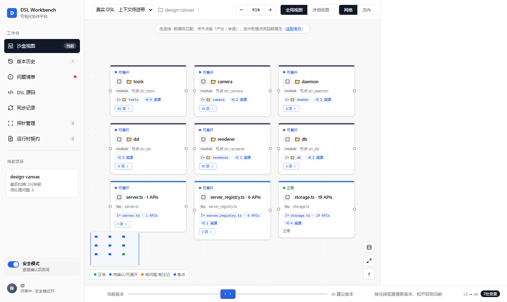

# design-canvas


> 让代码工程自带「活文档」与「质量防线」。以标准 MCP server 的形式，将设计与契约编码为结构化的 DSL JSON——随代码演进自动回填、永不陈旧；同时把 LLM 的代码改造变成「准确编辑、运行时验证、失败可回滚」的受控流水线。

[中文](README.md) · [English](README.en.md)



## 背景与定位

两个长期困扰工程协作的问题，design-canvas 同时给出解法：

**问题一：文档漂移。** 任何设计文档、架构图都会在代码演进后过期，最终没人敢信。design-canvas 把「设计真相」编码为**结构化的 DSL JSON**，随代码一起演进：语义层记录文件契约（files / apis / decisions），由 `backfill_scaffold` 从实现自动回填、由运行时观测（Camera）自动校正——**文档不再会过期**。

**问题二：改动失控。** LLM 改代码经常改错位置、改坏文件、无法验证，只能返工。design-canvas 提供一条受控的改造流水线：符号级准确编辑（`edit_code`）→ 改前真实 diff 审批 → 运行时探针对账验证 → 通过才提交、失败自动回滚——**改动不再靠赌**。

DSL 双层结构是两者的共同根基：

* **`geometry`（几何层）**：节点位置与连线，描述"长什么样"；
* **`semantic`（语义层）**：节点含义、契约与决策，描述"为什么这么做"。

人机协作是这套机制的载体而非全部：LLM 与人类共享同一份 DSL JSON，前端将其渲染为可交互图形，供审阅、标注与修改。

本项目遵循**前后端分离**架构：

| 层            | 职责                                                          | 载体                                                               |
| ------------ | ----------------------------------------------------------- | ---------------------------------------------------------------- |
| **数据 / 协议层** | DSL 存取、代码理解、生成/回填/一致性、积木体系、运行时验证、诊断闭环，对外提供 MCP 工具与 HTTP API | 本仓库（MCP server）                                                  |
| **可视化协作前端**  | 将实时 DSL 渲染为可交互工作台（沙盘、版本对比、问题清单、探针、契约、代码审批）                  | [dsl-workbench](https://github.com/xr192172/dsl-workbench)（独立仓库） |
| **内置渲染器**    | 无前端环境时的预览兜底，将单张 DSL 渲染为自包含 HTML                             | `render_dsl`（内置）                                                 |

## 核心能力

一条主线贯穿全局：**任意代码 → 积木（原料端）→ 可信组合（质检端）**。「契约」是两端共享的唯一接口——积木线负责生产契约，杂交线负责验证契约。

| 能力                | 说明                                             | 代表工具                                                                                                              |
| ----------------- | ---------------------------------------------- | ----------------------------------------------------------------------------------------------------------------- |
| **可视化协议层**        | DSL 读写编辑、设计视图与实际代码快照对比、内置渲染兜底                  | `get_dsl` / `edit_dsl` / `manage_feature` / `render_dsl` / `diff_views`                                           |
| **代码理解**          | 工程导入、语义搜索、影响分析、架构分层、单体拆分、算法/数据流推导              | `import_project` / `explore_code`                                                                                 |
| **代码积木体系**        | 从任意来源（URL / 本地工程）收割代码为带契约的积木，支持切块、抽契约、瘦身、搜索与拼装 | `harvest_from_url` / `harvest_closure` / `extract_contracts` / `slim_brick` / `search_bricks` / `assemble_bricks` |
| **运行时验证**         | 以实际运行观测对账契约与行为基线，形成「验证通过才提交，失败回滚」的防线           | `camera_instrument` / `camera_judge` / `chain_recon` / `reconcile_brick` / `reconcile_effects`                    |
| **生成 / 回填 / 一致性** | 从 DSL 生成代码骨架，解析实现回填契约，输出一致性报告                  | `scaffold` / `backfill_scaffold` / `consistency_check`                                                            |
| **确定性改造（防返工）** | 符号级代码编辑（绝不匹配错）、批量/跨文件重命名、死代码清理、改前 diff 审批、失败回滚 | `edit_code` / `rename_*` / `refactor_pipeline` |
| **诊断闭环**          | 症状 → 根因 → 修复 → 验证 → 提交（或回退）的完整链路               | `diagnose` / `refactor_judge` / `diagnose-loop`(CLI)                                                              |
| **多语言 AST 根基**    | 基于 tree-sitter 的符号 / import / 调用边 / 类型引用统一产出   | `ts_kernel` / `package_migration`                                                                                 |

## 快速开始

```bash
# 安装依赖
npm install

# 构建
npm run build

# 启动 MCP server（stdio 模式）
npm start
```

在 MCP client 配置中注册：

```json
{
  "mcpServers": {
    "design-canvas": {
      "command": "node",
      "args": ["/path/to/design-canvas/dist/src/server.js"]
    }
  }
}
```

也可以一键分发到各主流 MCP client（Claude / Cursor / VS Code / Codex / Copilot / Gemini / Windsurf / Cline）：

```bash
node scripts/install_mcp.mjs            # 写入全部已安装 client 的配置（自动合并 + 备份）
node scripts/install_mcp.mjs --list     # 查看各平台配置路径与写入状态
node scripts/install_mcp.mjs --dry-run  # 预览将写入的内容（不落盘）
node scripts/install_mcp.mjs --target claude  # 只写指定平台
```

### 一键体验（黄金演示路径）

想先看它长什么样？一条命令即可看到完整工作台——构建、注入内置示例、起服务、打开浏览器：

```bash
npm run demo                # 完整演示：渲染示例 → 启动服务 → 打开 /workbench
npm run demo -- 8081        # 指定端口
npm run demo -- --prepare   # 只准备示例（构建+渲染+注册），不起服务
```

浏览器会自动打开 `http://localhost:3000/workbench`：左侧画布是示例 DSL 渲染的可交互图（点击节点查看详情、条件分支动画流），右侧是沙盘反馈与代码审批。已有同名 feature 时自动跳过，不会覆盖你的数据。

> 完整可视化协作前端见 [dsl-workbench](https://github.com/xr192172/dsl-workbench)；不带前端环境时，内置渲染器（`render_dsl`）可把单张 DSL 渲染为自包含 HTML 预览。

## MCP 工具参考

共注册 **42 个 MCP 工具**，按「主工具 + 专项工具」组织：主工具承担统一入口，专项工具各司其职。

### 主工具（8 个）

| 主工具                 | 用途                                                                                 |
| ------------------- | ---------------------------------------------------------------------------------- |
| `get_dsl`           | 统一只读入口：DSL / 节点 / 边 / 文件 / 决策 / 批注 / 快照 / 仿真状态 / 差异等查询，支持 `view`（design/live）与过滤参数 |
| `edit_dsl`          | 统一写入口：`operations[]` 批量增删改、语义绑定、状态更新、标注、审批、自动布局，按序执行、任一失败全量回滚（原子）                  |
| `manage_feature`    | 功能生命周期管理：create / clone / template / list / delete                                 |
| `render_dsl`        | 渲染入口：mindmap / html / svg / markdown，支持 `view` 与输出路径                               |
| `scaffold`          | 从 DSL 语义层生成代码骨架（vue / react / html）+ 状态推断                                          |
| `backfill_scaffold` | 解析实现代码 API 签名回填 actual\_apis，输出差异报告                                                |
| `consistency_check` | 对比预期契约与实际代码，输出一致性报告与跨文件不变式（只读）                                                     |
| `explore_code`      | 代码理解入口：语义搜索、影响分析、架构分层、单体检测、拆分建议、算法/数据流推导、仿真回放等                                     |

### 专项工具（34 个）

**代码理解**

| 工具               | 用途                                             |
| ---------------- | ---------------------------------------------- |
| `import_project` | 导入代码项目为 DSL（支持本地绝对路径与浏览器上传，遵循 `.gitignore` 过滤） |
| `diff_views`     | 对比设计视图与 live 代码快照                              |
| `render_sandbox` | 渲染依赖驱动的功能社区工作台（积木化预览）                          |

**积木体系**

| 工具                  | 用途                              |
| ------------------- | ------------------------------- |
| `harvest_closure`   | 连同传递 import 闭包收割积木              |
| `harvest_from_url`  | 从 git URL / 本地项目收割积木入箱          |
| `extract_contracts` | 抽取积木契约（role / shapes / effects） |
| `reconcile_effects` | 用运行时观测对账 effect 候选              |
| `reconcile_brick`   | 用运行时观测对账积木契约                    |
| `search_bricks`     | 搜索积木架（跨项目复用目录）                  |
| `assemble_bricks`   | 用箱装积木拼装新项目                      |
| `slim_brick`        | 将 Go 积木瘦身为派生积木（编译器式死码剪枝）        |
| `narrate_step`      | 将流水线步骤叙述为受治理的叙述积木               |

**运行时验证（Camera）**

| 工具                  | 用途                           |
| ------------------- | ---------------------------- |
| `camera_instrument` | 自动插桩 / 还原 TS 项目，写盘后生成探针台账与统计 |
| `camera_log`        | 按文件查询运行时日志                   |
| `camera_judge`      | 批量裁决运行时事件                    |
| `chain_recon`       | 将宿主链与其真实运行事件对账               |

**确定性改造**

| 工具                    | 用途                                         |
| --------------------- | ------------------------------------------ |
| `edit_code`           | 符号级代码编辑（replace / insert / delete / range） |
| `rename_many`         | 批量重命名局部变量（作用域隔离）                           |
| `rename_symbol`       | 跨文件模块级符号重命名                                |
| `rename_file`         | 文件级重命名 + import 引用改写                       |
| `remove_dead_imports` | 移除失效 import                                |
| `refactor_pipeline`   | 确定性重构流水线（死代码清理 + 包迁移）                      |
| `suggest_renames`     | 为短名 / 无意义变量建议语义化名字                         |
| `find_similar_names`  | 检测易混淆相似名并消歧                                |

**诊断与审阅**

| 工具               | 用途                                         |
| ---------------- | ------------------------------------------ |
| `refactor_judge` | LLM 审裁决门：采纳 / 驳回 / 上抛不确定项                  |
| `diagnose`       | 症状 → 根因分析：定位候选 → 调用链追溯 → 影响面 → 根因聚合 → 验证建议 |

**画布批注**

| 工具                         | 用途                      |
| -------------------------- | ----------------------- |
| `read_canvas_notes`        | 读取画布几何批注，转为语义工单         |
| `mark_canvas_notes_status` | 更新批注状态（处理 / 关闭）         |
| `decide_canvas_notes`      | 由 LLM 裁决批注与 DSL 目标的对应关系 |

**LLM 网关**

| 工具                        | 用途                          |
| ------------------------- | --------------------------- |
| `gateway_list_providers`  | 列出已配置的 LLM 供应商（脱敏）          |
| `gateway_upsert_provider` | 新增 / 更新供应商（Key 池，轮询 + 失败转移） |
| `gateway_delete_provider` | 删除供应商                       |
| `gateway_stats`           | 用量统计（调用数 / token / 费用 / 错误） |

**项目文档**

| 工具                  | 用途                       |
| ------------------- | ------------------------ |
| `read_project_docs` | 读取项目 `docs/` 目录下的文档清单与正文 |

### `view` 参数

* `design`（默认）：设计视图——活跃 DSL + 功能存档，是 LLM 主动设计与迭代的对象，对应浏览器「设计」视图；

* `live`：实际视图——只读的代码快照，由 `import_project` / `explore_code` 重建，对应浏览器「实际」视图。

设计视图是迭代的对象，实际视图是代码的现状，二者通过 `diff_views` 对比。

## 能力矩阵与多语言支持

工具基于 **168+ 语言 AST 解析器**（tree-sitter）按需拉取。核心通用根基 `ts_kernel` 对已安装语言全量支持（符号 / import / 调用边 / 类型引用）；部分改造类功能按语言分级落地：

* **full\_ast**：Go / TypeScript / JS 家族全量；Python 视功能而定

* **regex\_fallback**：少数功能对个别语言回退到正则

* **unimplemented**：未落地的「功能 × 语言」对——显式登记，可见、可排期

体检时自动扫描缺口：

```bash
npm run doctor        # 环境就绪检查 + 能力矩阵缺口自检
npm run capability    # 单独输出能力缺口（JSON / 人类可读）
```

## 诊断闭环（CLI）

`diagnose-loop` 将诊断从「只给建议」升级为「闭环执行」：诊断 → 修复 → 验证 → 提交（或回退）。

```bash
npm run diagnose-loop -- --project <项目目录> --symptom "<症状>"
```

| 参数                     | 说明                           |
| ---------------------- | ---------------------------- |
| `--project <dir>`      | 目标项目（必须是 git 仓库，回退依赖 git 还原） |
| `--symptom "<症状>"`     | 症状描述（报错信息 / 现象）              |
| `--auto`               | 全自动：基线提交 + 跳过补丁审批 + 验证通过自动提交 |
| `--apply`              | 跳过补丁审批直接应用（仍先打印待审批真实 diff）   |
| `--skip-verify`        | 跳过验证阶段                       |
| `--verify-timeout <秒>` | 验证命令超时（默认 300s）              |

执行流程：基线快照（改前自动提交）→ 建立符号缓存 → 诊断（规则 + LLM 双引擎）→ LLM 行级补丁（修改白名单 + 行号越界校验 + 审批展示真实 diff）→ 运行项目测试验证：通过则精确提交补丁文件，失败则自动回退。

## 测试与验证

```bash
npm test              # vitest 全量
npm run doctor        # 环境体检 + 能力缺口
```

## 技术栈

* **MCP server**：TypeScript + [@modelcontextprotocol/sdk](https://www.npmjs.com/package/@modelcontextprotocol/sdk)

* **AST 解析**：tree-sitter（Go / TypeScript / Python / JavaScript），动态检测语言包

* **渲染器**：HTML 字符串拼接（零构建链，产物单文件自包含）

* **Schema 校验**：ajv + ajv-formats

* **测试**：vitest

## Agent 指引

仓库内置面向 Agent 的 skill（`.trae/skills/`）：

* **design-canvas-router**：渐进披露路由，按「遇到什么问题 → 调哪个工具」分层定位，先查询已有能力再决定是否新建工具；

* **design-canvas-mind**：心智外衣，提供能力地图、需求到工具链的编排、工具调用缓存与诚实交付纪律。

使用本工具链前建议先加载这两个 skill，避免重复造轮子。

## License

MIT
